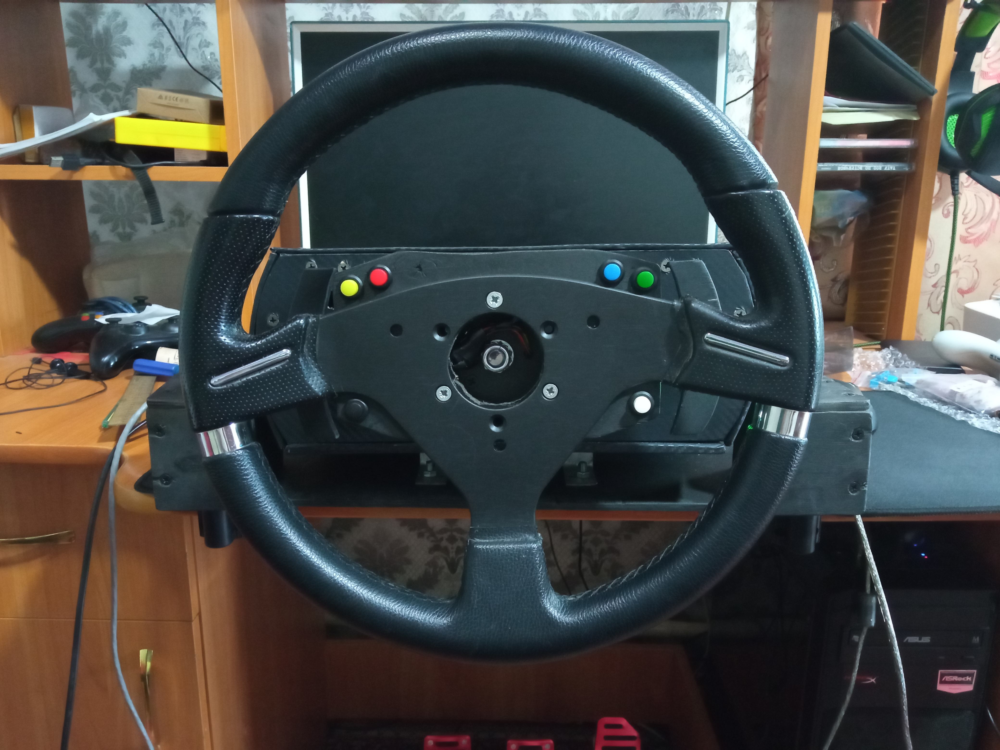
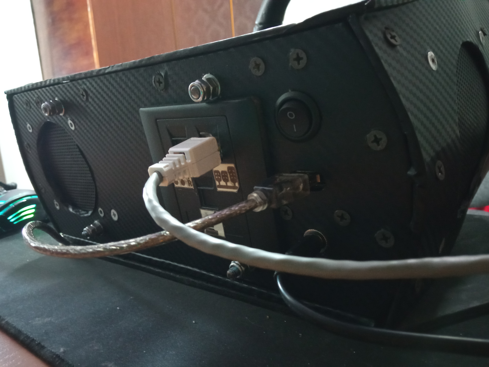
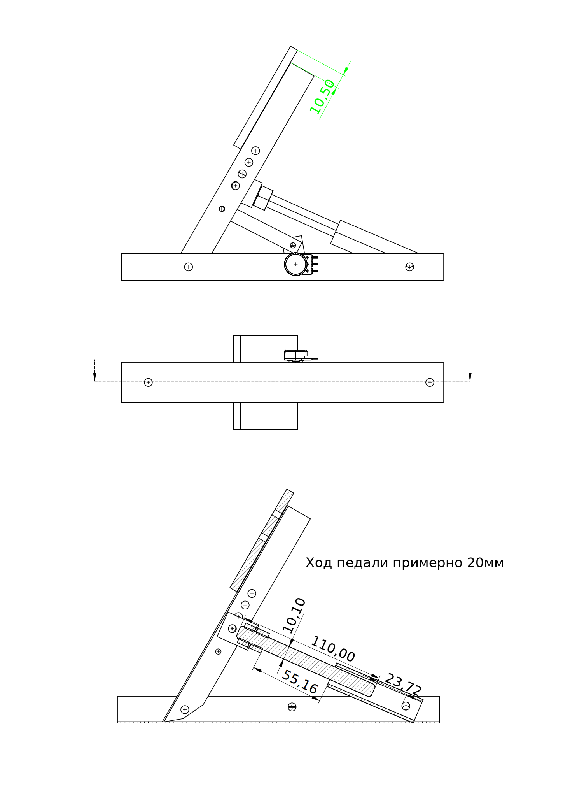

# Самодельный игровой руль с обратной связью

Это мой проект для личного использования. Но я буду рад если помогу кому то своими идеями. Здесь только чертежи проекта. Я использовал для чертежей **[FreeCAD](https://wiki.freecadweb.org/)**, это бесплатное ПО, скачать его можно **[здесь](https://wiki.freecadweb.org/Download)**.

Я сделал руль в основном из фанеры и ЛДСП. Я использовал два мотора 775 с передаточным числом 1:10.

Электроника основана на Arduino leonardo.

Для прошивки я использовал проект **[AFFBWheel](https://github.com/vsulako/AFFBWheel)**. Автор проекта своевременно исправляет ошибки и дорабатывает прошивку, добавляет новый функционал.

*Если будет интерес к проекту то я буду дополнять описание и чертежи. О своей заинтересованности или по каким то вопросам можете писать в **[Discussions](https://github.com/lazenyuk-dmitry/SterringWheel/discussions)**.*

Цвета в проекте:

*  - ЛДСП.
*  - фанера.

## Описание файлов проекта

* `assets` - содержит импортированные модели.
* `images` - картинки проекта.
* `pdf` - PDF файлы модели.
* `Base.FCStd` - модель базы.
* `PaddleShifter.FCStd` - модель подрулевых лепестков.
* `PaddleShifter-v2.FCStd` - подрулевые лепестки 2 версия.
* `Pedals.FCStd` - модель педалей.
* `Wheel.FCStd` - модель руля.

В программе *FreeCAD* есть справа панель. В ней ищите папку чертежи.

## Немного фотографий

## Педали

Для педалей я использовал следующее:

* Профиль, вроде бы им усиливают пластиковые окна. Он мне достался бесплатно.  
  
Профиль 30х20mm.
* Потенциометры на 10К.
* Проволока 1-2mm или спица от велосипеда.
* Фанера 6mm.
* ЛДСП 16mm.
* Накладки на педали я покупал **[здесь](https://aliexpress.ru/item/1005003505176644.html?gatewayAdapt=glo2rus&sku_id=12000026090502777&spm=a2g0s.12269583.0.0.24d251bdbd2Qhi)**. Но они мне не особо нравятся.
* Пружины использовал следующие:
  * Для педали газа **[Диаметр проволоки:2.0mm, Длинна:100mm (2Pcs), Наружныи диаметр:30mm](https://aliexpress.ru/item/4000436939383.html?gatewayAdapt=glo2rus&sku_id=12000020467700623&spm=a2g0s.12269583.0.0.4fc54c973GwjMA)**.  
    
  *Можно взять диаметр меньше так как пружина одевается на шток 10мм, возможно у вас будет другой*
  * Для педали сцепления **[1.5x18x305mm](https://aliexpress.ru/item/4001041195904.html?gatewayAdapt=glo2rus&sku_id=12000027302892670&spm=a2g0s.12269583.0.0.93c96c83OTTFEP)**.  
    
  *Но мне кажется нужно потолще пружину ставить*.
  * На педаль тормоза я нашел пружину от клапанов *МТЗ*. Думаю можно подобрать от автомобиля или мотоцикла с клапанов. И добавил еще кусочек пружины 1.5мм  
    
  *У пружины большой внутренний диаметр поэтому я засунул во внутрь кусок шланга*.
* Труба металлопластик 16мм.
* Провода.
* Болты и гайки и шайбы M10, M6, M4.
* Шпилька для штока M10 а лучше прут 10мм и нарезать резьбу на краю.  
    
  *Я не нашел нормальные шпильки. В магазине какая то острая резьба сильно и это мешает*.  
    
  Вот с такой резьбой шпильки найти будет нормально я думаю.
   
  *Так что самое сложное - это сделать нормальный шток, чтобы он ходил во втулке и не терся резьбой. Можно конечно сделать и из фиговой шпильки, но будет не очень.*

### Теперь расскажу про конструкцию педалей

Основное это нужно изготовить основу и рычаг из профиля.

  

А вот педаль в разрезе.

*На фотографиях педаль сцепления отличается креплением втулки. Это я пробовал сделать сцепление с эффектом корзины, но пока что не получилось. Но так если выше поднять втулку мне кажется становится жестче педаль.*

Теперь нужно изготовить механизм педали. Шток, втулку и крепление к рычагу.

Втулку я немного закруглил и вставил кусочки шланга.

Есть чертеж такой педали сцепления с эффектом корзины. За прототип взял педали caravangoes. Но я еще не проверял эту идею. Пока только набросок.

Ну в принципе и все. Собираем педали. И делаем корпус.

Затем устанавливаем все на корпус.

Накладки на педали можно сделать и из фанеры.

На низ я прикрутил куски резины вырезанные из б/у автомобильного коврика.

Вот собственно и вся конструкция педалей.
